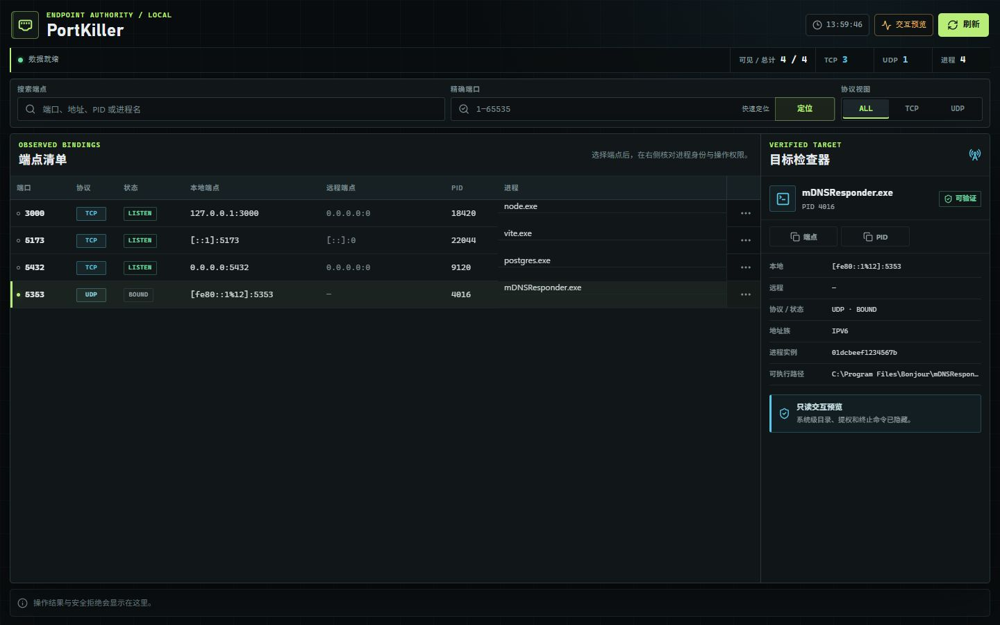
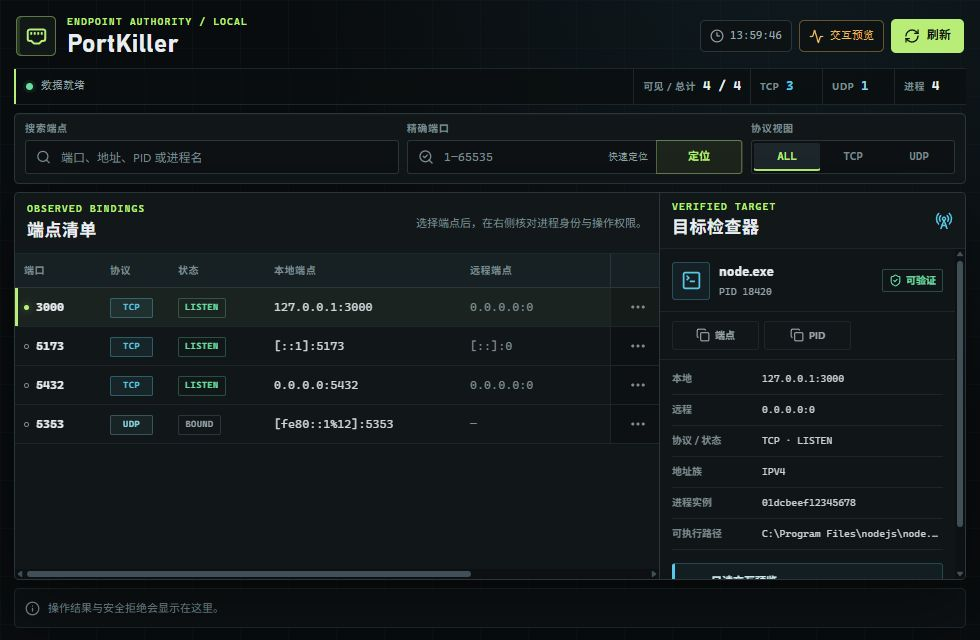

# PortKiller

PortKiller is a Windows desktop control console for inspecting IPv4 and IPv6
TCP/UDP endpoints and safely terminating the exact process instance that owns a
selected endpoint. It combines a React interface with a Rust/Tauri backend that
reads the Windows IP Helper tables directly.



> The screenshot uses deterministic Preview sample data. Preview mode supports
> filtering, selection, refresh, and copy interactions, but hides directory,
> elevation, and termination commands.

## Highlights

- Scan TCP and UDP bindings across both IPv4 and IPv6.
- Inspect local and remote endpoints, connection state, address family, PID,
  process name, executable path, and process-instance identity.
- Search the full inventory, filter by protocol, locate an exact port, refresh,
  and copy endpoint or PID values.
- Reveal an executable in Explorer and restart with administrator privileges
  when running inside the Windows desktop application.
- Use a keyboard-operable endpoint table, row menu, and destructive confirmation
  dialog with reduced-motion support.
- Distinguish terminated, already-exited, rejected, and failed operations instead
  of treating every backend response as success.

## Safety Model

Process termination crosses a destructive trust boundary, so PortKiller does
not act on a PID or process name alone.

- The UI forwards the backend-issued `entry_id`, normalized endpoint, PID, and
  process-instance identifier unchanged.
- Immediately before termination, the backend revalidates the entry identity,
  Windows process creation time, protection status, and exact endpoint ownership.
- Identity checks, liveness checks, termination, and exit confirmation use the
  same retained process handle.
- Only the selected PID is targeted; PortKiller does not expand to same-name
  processes, siblings, parents, or a process tree.
- Missing, changed, protected, or ambiguous identity data fails closed.
- Success is reported only after Windows confirms that the retained process
  handle is signaled.

These checks reduce stale-row and PID-reuse risks, but terminating a process is
still destructive. Review the selected executable and endpoint before confirming.

## Minimum Window

The desktop window is designed to remain usable at 980 × 640. The endpoint
table keeps its action column visible while allowing the data columns and target
inspector to scroll within their own regions.



## Stack

- Tauri 1 desktop shell
- Rust backend using Win32 APIs through `windows-sys`
- React 18, TypeScript, and Vite 8 frontend
- Vitest, Testing Library, ESLint, Rustfmt, Clippy, and Cargo tests

## Requirements

- Windows 10 or Windows 11
- Node.js `^20.19.0`, `^22.13.0`, or `>=24`
- npm 11 (the lockfile is currently managed with npm 11.9.0)
- A recent stable Rust toolchain with the MSVC target
- Visual Studio C++ Build Tools with the "Desktop development with C++" workload

## Development

Install the lockfile-pinned dependencies:

```powershell
npm ci
```

Run the reproducible browser Preview with sample endpoint data:

```powershell
npm run dev
```

Run the real Windows desktop application:

```powershell
npm run tauri -- dev
```

Real port inspection, path reveal, elevation, and process termination are only
available in the Tauri runtime. Browser Preview never performs system commands.

## Verification

Run the complete frontend and Rust quality gate:

```powershell
npm run check
```

This covers TypeScript, ESLint with zero warnings, frontend tests, real web-build
output isolation, Rustfmt, Clippy with warnings denied, and locked Rust tests.
Dependency reviews can be repeated with:

```powershell
npm audit
npm audit --omit=dev
```

## Build the Executable

```powershell
npm run build:exe
```

The raw Tauri executable is produced at
`src-tauri/target/release/PortKiller.exe` and copied to
`dist/PortKiller.exe`. The packaging script uses the lockfile-installed Tauri
CLI and does not require WiX/MSI bundling.

Frontend assets are isolated under `dist/web`, so `npm run build` does not
overwrite or delete an existing `dist/PortKiller.exe`. See
[`docs/packaging.md`](docs/packaging.md) for packaging details and
troubleshooting.
